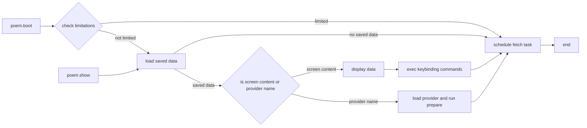
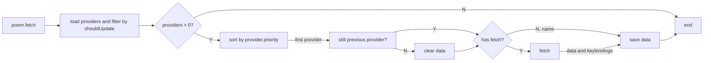

# @everseen/coc-poem

A [con.nvim](https://github.com/neoclide/coc.nvim) plugin to render custom vim welcome screen.

## Usage

> Note: better turn off vim default intro message: `set shm+=I` first.

[Install](https://github.com/neoclide/coc.nvim/wiki/Using-coc-extensions#install-extensions) this extension and add this to your vimrc:

```vim
au VimEnter * call coc#rpc#notify('runCommand', ['poem.boot'])
```


There are several builtin commands, e.g. `:CocCommand poem.show`:

+ `poem.boot`: change the default vim welcome screen by poem screen, will do noting if you are running `nvim` with args, using gvim or in insert mode.

+ `poem.show`: show a poem screen. **DON'T** use this command on boot.

+ `poem.fetch`: immediately fetch poem providers.

+ `poem.showOutputChannel`: display logs

+ `poem.clearOutputChannel`: clear logs

## Provider

This extension use providers to fetch data. A provider is just a script file put in `~/.config/coc-poem/<your-provider>/index.js`. See [examples](./examples) as an example.

### Provider Load Strategy (`poem.boot` and `poem.show`)



### Provider Fetch Stategy  `poem.fetch` 

Saved data is always used for **NEXT** startup.



### Provider API

```ts
export type ProviderApi = {
  name: string;
  root: string;
  logger: Logger;
  config: PoemConfig;
  coc: typeof coc;
  context: coc.ExtensionContext;
  data?: SavedData;
};

// User Defined Provider
export interface ProviderUD {
  shouldUpdate?: MaybeAsync<boolean, ProviderApi>; // shouldUpdate: boolean|((api: ProviderApi) => (boolean|Promise<boolean>))
  shouldUseBrowser?: MaybeAsync<boolean, ProviderApi>;
  getPriority?: MaybeAsync<number, ProviderApi>;
  fetchData?: MaybeAsync<{ content: any, commands?: string[] }, ProviderApi & { browser?: puppeteer.Browser }>
  prepareScreen?: MaybeAsync<void, ProviderApi & { screen: Screen }>
}
```

#### `shouldUpdate`

+ default: `true`

Whether to fetch provider data at this time, the fetch will run in backend silently.

#### `shouldUseBrowser`

+ default: `false`

There is a builtin headless browser support (use [puppeteer](https://github.com/puppeteer/puppeteer)), set `true` if you want to fetch sth from the Internet. Use with caution because this may slow down your vim exit process and lead to memory leak, see [examples/headless-browser](./examples/headless-browser) for more detail.

#### `getPriority`

+ default: `0`(higher is prior)

You can write as many providers as you want, but only the most prior one will be select each time.

#### `fetchData`

+ default: undefined

Describe how the provider fetches data. This is not required because you may want just render some realtime data.

#### `prepareScreen`

> **The only function a provider should implement.**

Descrbe how the provider renders. You can also bind your own keybindings for the poem screen buffer in this function.

## Extension Settings

Some configuration can be changed in [coc.nvim](https://github.com/neoclide/coc.nvim) config file:

### `poem.providerDir?: string`

+ default: `~/.config/coc-poem`(*nix), `~/AppData/Local/coc-poem`(win)

Where to find your provider scripts, each folder is considered as a provider if a `index.js` script file found. Provider data is also cached here (`./data.json`).

### `poem.updateTime?: number`

+ default: `60000`(ms)

When to start updating provider in background.

### `poem.screenFPS?: number`

+ default: `2`

The poem screen refreshes `<poem.screenFPS>` times per second. Don't set too high because the render is async and that may cause unexpected behavior.

### `poem.launchBrowsers: ?`

How to launch puppeteer browser, the option will be passed to `puppeteer.launch`. Default:

```ts
{
  executablePath: 'google-chrome',
  ignoreHTTPSErrors: true,
  headless: true,
  args: [
    '--no-sandbox',
    '--disable-setuid-sandbox',
    '--disable-web-security',
    '--user-agent=Mozilla/5.0 (X11; Linux x86_64) AppleWebKit/537.36 (KHTML, like Gecko) Chrome/98.0.4758.102 Safari/537.36',
  ],
}
```

## Q&A

### Why `coc-poem`, not `coc-startify` or something like that?

I use this extension to fetch a Chinese poem from the Internet every day 🍵~

